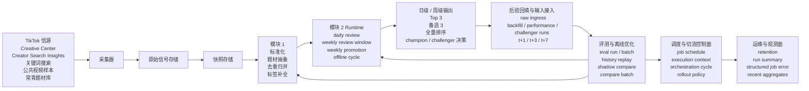

# AutoTikTok 技术方案

## 1. 目标

AutoTikTok 是一个面向 TikTok 热门题材策略的 skill，包含两个核心模块：

- 模块 1：基于 TikTok 信号构建结构化题材候选池
- 模块 2：对候选题材做评分、排序和解释

这个项目的目标不是预测整个互联网的所有热点新闻。更准确的问题定义是：

`基于 day_t 当天可见的 TikTok 信号，识别并排序 day_t+1 到 day_t+3 最值得生产的题材。`

这样可以让系统始终围绕平台内可观测信号运转，而不是做开放式预测。

## 2. 产品范围

### 本期范围

- TikTok 信号采集
- 日级快照存储
- 题材抽象与去重归并
- 8 维题材评分
- 推荐理由与建议动作输出
- 后验回填与评测闭环
- 基于 Autoresearch 思路的离线优化

### MVP 暂不包含

- 自动生成脚本
- 自动发布
- 全量竞品监控
- 基于 OCR/ASR 的复杂视频结构理解
- 大规模社会仿真

## 3. 来源文档

这份方案整合了以下文档中的决策：

- [热门题材策略.md](热门题材策略.md)
- [热门题材策略模块开发需求.md](热门题材策略模块开发需求.md)

评分维度已经和 PRD 对齐，当前 MVP 已经纳入：

- 搜索承接能力
- 素材执行可行性

## 4. 总体架构



这张图同时表达目标产品流和当前 repo 内已经落地的工程模块。

当前已完成的模块主要包括：

- `模块 2 Runtime`
  - `daily review`
  - `optimizer-weekly-review-window`
  - `weekly-promotion`
  - `optimizer-offline-cycle`
- `后验回填与输入接入`
  - raw ingress adapters
  - backfill / performance / challenger job-run envelope
  - `sample_canonical`、`sample_raw_shadow`、`real_provider_shadow` 三条输入 lane
- `评测与离线优化`
  - `optimizer-eval-run`
  - `optimizer-eval-batch`
  - `optimizer-eval-batch-history`
  - history replay
  - shadow compare / compare batch
- `调度与切流控制面`
  - `optimizer-job-schedule`
  - `optimizer-job-execution-context`
  - `optimizer-job-orchestration-cycle`
  - input rollout / runtime profile rollout / scheduler intent
- `运维与观测面`
  - artifact retention policy
  - `optimizer-run-summary`
  - `optimizer-job-error`
  - recent run / compare / weekly decision / failure aggregates

当前已经跑通的核心流程包括：

- `daily review -> weekly review window -> weekly promotion`
- `input manifest / bundle -> offline cycle -> eval run / eval batch`
- `production / raw shadow / real provider shadow -> shadow compare / compare batch`
- `job schedule -> execution context -> orchestration cycle -> run summary / recent aggregates`

当前仍然主要停留在方案层、还没有完成真实接线的部分包括：

- TikTok 采集器本身
- 快照与原始信号存储
- 模块 1 的真实候选池构建流水线

## 5. 官方与补充信源策略

### 主要官方网页信源

- TikTok Creative Center
  - 趋势发现
  - 热门视频
  - Top Ads / Top Content 参考
- Creator Search Insights
  - 热门搜索词
  - 相关搜索
  - 内容缺口

### 补充信源

- 基于搜索词、hashtag、seed topic 拉取的公共 TikTok 视频样本
- 按赛道和市场维护的常青题材库
- 后续阶段可选接入已授权创作者账号表现数据

### 关键约束

目前没有一个适合作为 MVP 主依赖的、面向普通开发者开放的平台级官方热门榜单 API。更现实的做法是：

- 以官方网页工具为主信源
- 采用浏览器采集和快照固化
- 以公共视频采样做增强

## 6. 采集器设计

模块 1 从 `Signal Ingestion` 开始，建议把采集器拆成三条链路。

### 6.1 `collector_creative_center`

目标：

- 采集趋势发现榜单
- 采集热门视频参考
- 采集趋势详情页

建议实现：

- 使用 Playwright 做浏览器自动化
- 使用 Crawlee 做队列、重试、会话管理和持久化

输出：

- `trend_rank_items`
- `trend_detail_items`
- `top_video_items`

### 6.2 `collector_search_insights`

目标：

- 采集热门搜索词
- 采集相关搜索
- 采集内容缺口
- 采集与题材机会相关的搜索证据

建议实现：

- Playwright + Crawlee

输出：

- `search_signal_items`
- `related_query_items`
- `content_gap_items`

### 6.3 `collector_public_tiktok`

目标：

- 采集公共视频样本，补充题材证据
- 获取标题、描述、hashtags、作者、发布时间和互动数据

建议实现：

- 使用公共 TikTok 采集库或服务封装
- 只作为增强层，不作为主趋势真值来源

输出：

- `video_samples`
- `public_signal_items`

## 7. 核心存储层

### 7.1 `source_snapshots`

每次采集任务一条主记录，按时间切片冻结。

建议字段：

- `snapshot_id`
- `source`
- `market`
- `language`
- `niche`
- `captured_at`
- `status`
- `collector_version`

### 7.2 `signal_items`

来自榜单页、搜索页、缺口页的原子信号记录。

建议字段：

- `signal_id`
- `snapshot_id`
- `source`
- `source_subtype`
- `raw_text`
- `rank_value`
- `heat_value`
- `meta_json`

### 7.3 `video_samples`

官方或公共来源的视频参考样本。

建议字段：

- `video_id`
- `snapshot_id`
- `source`
- `title`
- `desc`
- `hashtags_json`
- `author_id`
- `published_at`
- `metrics_json`

### 7.4 `account_profiles`

模块 2 使用的账号执行能力画像。

建议字段：

- `account_id`
- `market`
- `language`
- `niche`
- `accepted_formats_json`
- `available_asset_types_json`
- `production_budget_level`
- `turnaround_speed`
- `can_do_talking_head`
- `can_do_screen_recording`
- `can_do_ai_gen`
- `updated_at`

## 8. 模块 1 设计

模块 1 的定位是 `题材候选池构建器`，不是最终选择器。

### 8.1 目标

把分散的平台信号转换成一组候选题材，这组候选必须满足：

- 有真实证据支撑
- 已被抽象成可生产的题材
- 已完成合并和去重
- 已补充下游打分需要的标签
- 能够支持历史回放和评测

### 8.2 流水线

1. `Signal Ingestion`
2. `Normalization`
3. `Topic Abstraction`
4. `Candidate Expansion`
5. `Merge & Dedupe`
6. `Tagging & Packaging`

### 8.3 核心原则

- `source-grounded`
- `abstract-not-copy`
- `merge-before-rank`
- `evidence-preserved`

### 8.4 内部对象层次

#### `signal`

最小的可观测信号单元，例如：

- 一个搜索 query
- 一个内容缺口项
- 一条榜单项
- 一条视频参考样本

#### `evidence_bundle`

若干条 signal 聚合成的证据包，共同支撑一个题材机会。

#### `topic_candidate`

最终发送给模块 2 的结构化题材对象。

### 8.5 模块 1 输出 Schema

```json
{
  "topic_id": "tp_xxx",
  "topic_fingerprint": "sha1(normalized_topic)",
  "topic_title": "...",
  "topic_summary": "...",
  "topic_type": "trend|search|evergreen",
  "source_type": ["creative_center_trend", "search_insights", "video_sample"],
  "source_ref": ["signal_1", "video_2"],
  "keywords": [],
  "content_angle": [],
  "recommended_mode": "growth|search|series",
  "expandability": 0.0,
  "freshness_window": "daily|weekly|evergreen",
  "search_evidence": {
    "seed_queries": [],
    "related_queries": [],
    "content_gap_queries": [],
    "search_intent_type": "how_to|mistake|comparison|case|trend_reaction",
    "search_persistence_hint": "daily|weekly|evergreen"
  },
  "execution_profile": {
    "recommended_formats": [],
    "required_assets": [],
    "required_capabilities": [],
    "production_complexity": 0.42,
    "dependency_risk": "low|medium|high",
    "fast_turnaround": true
  },
  "execution_notes": "..."
}
```

### 8.6 为什么必须有 `search_evidence` 和 `execution_profile`

当前 MVP 已经包含：

- 搜索承接能力
- 素材执行可行性

这两个维度都无法仅靠题材标题可靠判断，所以模块 1 必须提前准备好这两类上游证据。

## 9. 模块 2 设计

### 9.1 目标

模块 2 是一个可解释的评分与排序引擎，不应该变成一个自由发挥的 LLM 选题器。

### 9.2 八维评分体系

1. 需求强度
2. 竞争强度
3. 账号适配度
4. 原创改写空间
5. 可系列化程度
6. 搜索承接能力
7. 可扩成长内容潜力
8. 素材执行可行性

### 9.3 总分公式

```text
score_total =
  demand*W1 +
  fit*W2 +
  rewrite*W3 +
  series*W4 +
  search_capture*W5 +
  longform*W6 +
  feasibility*W7 -
  competition*W8
```

### 9.4 权重档位

#### 模式 A：冷启动与起量

```json
{
  "demand": 0.24,
  "fit": 0.18,
  "rewrite": 0.14,
  "series": 0.08,
  "search_capture": 0.14,
  "longform": 0.06,
  "feasibility": 0.12,
  "competition": 0.1
}
```

#### 模式 B：放大与过渡

```json
{
  "demand": 0.16,
  "fit": 0.18,
  "rewrite": 0.1,
  "series": 0.16,
  "search_capture": 0.1,
  "longform": 0.14,
  "feasibility": 0.08,
  "competition": 0.08
}
```

#### 搜索优先档

```json
{
  "demand": 0.22,
  "fit": 0.16,
  "rewrite": 0.1,
  "series": 0.08,
  "search_capture": 0.22,
  "longform": 0.06,
  "feasibility": 0.12,
  "competition": 0.08
}
```

### 9.5 模块 2 输出 Schema

```json
{
  "topic_id": "tp_xxx",
  "score_total": 4.28,
  "score_breakdown": {
    "demand": 5,
    "competition": 2,
    "fit": 4,
    "rewrite": 4,
    "series": 3,
    "search_capture": 5,
    "longform": 2,
    "feasibility": 4
  },
  "priority_level": "P0",
  "recommended_use": "growth|search_capture|series_seed|longform_expand",
  "score_reason": "...",
  "risk_flag": ["too_generic", "high_competition_density"],
  "next_action": "generate script|hold as backup|not recommended"
}
```

### 9.6 模块边界

模块 1 负责：

- 找题材并结构化
- 保留证据链
- 补充候选属性标签

模块 2 负责：

- 计算特征值
- 打分和重排
- 生成推荐理由和风险提示

## 10. 评测与反馈闭环

### 10.1 评测层次

- `golden_regression_set`
  - 稳定的人工标注回归样本
- `rolling_snapshot_set`
  - 每日新增的时间切片样本
- `realized_outcome_set`
  - `t+1`、`t+3`、`t+7` 的后验标签
- `hidden_holdout_set`
  - 用于离线优化的冻结隐藏验证集

### 10.2 双层评测思路

我们采用双层评测：

- 题材机会层
  - 评估模块 2 对“题材机会”本身的判断是否正确
- 发布表现层
  - 评估真实发布内容的表现是否支持该题材判断

默认原则：

- 题材机会层是主评估层
- 发布表现层是增强层
- 真实视频表现可以增强 reward，但不直接替代题材层判断

这样可以避免把“执行质量问题”误判成“题材判断错误”。

### 10.3 题材机会层核心指标

- `Hit@3`
- `Hit@10`
- `NDCG@10`
- `DupRate`
- `TypeCoverage`
- `Novelty`
- `ExecutableRate`

### 10.4 题材机会层 Reward

```text
TopicReward =
  0.30*Hit@3 +
  0.20*NDCG@10 +
  0.15*Hit@10 +
  0.10*Novelty +
  0.10*TypeCoverage +
  0.10*ExecutableRate -
  0.15*DupRate
```

### 10.5 发布表现层指标

发布表现层只在存在真实发布数据时启用。建议优先使用归一化指标，而不是直接使用原始播放量。

推荐指标：

- `ViewLift`
  - 视频播放量相对账号基线或内容桶基线的提升
- `RetentionProxy`
  - 可用时使用完播率、前 3 秒留存或 watch time 代理
- `ShareSaveProxy`
  - 可用时使用分享、收藏等互动代理
- `FollowConversionProxy`
  - 可用时使用关注转化代理

MVP 阶段如果暂时只能稳定拿到播放量，则先只启用：

- `ViewLift`

这里不建议直接使用原始 `views`，而建议使用：

- 相对账号历史中位数的提升
- 相对同内容桶历史中位数的提升
- capped 或 log-normalized 后的播放表现

这样可以减少单条偶发爆款对 reward 的污染。

### 10.6 发布表现层 Reward

当存在真实发布数据时，建议计算：

```text
PerformanceReward =
  0.50*ViewLift +
  0.20*RetentionProxy +
  0.15*ShareSaveProxy +
  0.15*FollowConversionProxy
```

如果当前阶段只有播放量，则退化为：

```text
PerformanceRewardMvp = ViewLift
```

### 10.7 组合 Reward

最终 reward 采用题材层主导、发布层增强的方式：

```text
CombinedReward =
  TopicReward * (1 - PerformanceWeight) +
  PerformanceReward * PerformanceWeight
```

其中：

- 默认 `PerformanceWeight` 建议不高于 `0.15`
- 当没有真实发布数据时，`PerformanceWeight = 0`
- 当发布覆盖不足时，`PerformanceWeight` 应继续降低

建议规则：

- 日级 `t+1` 评测默认以 `TopicReward` 为主
- 只有当某个题材存在可归因的真实发布结果时，才把 `PerformanceReward` 纳入该 run 的总评估
- 周级晋升时优先看 `CombinedReward`，同时单独报告 `TopicReward` 和 `PerformanceReward`

### 10.8 后验回填策略

每次日级预测运行都要在未来这些时间点做评估：

- `t+1`
- `t+3`
- 可选 `t+7`

后验标签建议由以下信号组合得到：

- 未来搜索提升
- 未来视频密度
- 未来内容缺口持续性

如果存在真实发布数据，还建议额外回填：

- 发布视频的归一化播放表现
- 可用时的留存代理
- 可用时的互动代理
- 可用时的关注转化代理

### 10.9 为什么播放量只作为增强信号

不建议把播放量直接当作题材判断的唯一真值，原因包括：

- 播放量会受到 hook、首屏、剪辑、发布时间和账号波动影响
- 题材判断和执行质量是两个不同层次
- 某个题材后验信号很强，但单条执行可能失败
- 某条视频偶发爆量，也不一定说明题材判断稳定正确

因此：

- 题材层 reward 负责判断“这个题材机会是否真实存在”
- 发布层 reward 负责判断“这个题材在真实执行中是否也表现良好”

## 11. Autoresearch 式离线优化

Autoresearch 适合做离线优化器，不适合直接作为在线运行框架。

我们采用更激进的节奏，但不采用“每日自动全量升级 champion”的模式。目标节奏是：

- 每日优化
- 每日复盘
- 每周正式晋升

这里的关键原则是：

- 每天都允许生成和评估新的 challenger
- 每天都允许更新 shadow 排行和诊断结果
- 只有通过周级晋升门槛的 challenger 才能替换线上 champion

### 11.1 可优化对象与不可优化对象

建议允许优化的对象：

- 题材抽象 prompt
- query 扩展 prompt
- 合并阈值
- 标签规则
- 评分权重
- 多样性重排策略
- 理由生成模板

不建议让优化器改动：

- 核心 schema
- 评测代码
- 标签定义逻辑
- 采集器契约

### 11.2 每日优化但不每日全量升级

优化环分成两层：

- 线上 champion
  - 当前日常 `cron B` 实际使用的稳定版本
- shadow challengers
  - 每日优化环生成和评估的候选版本

daily optimizer 允许做的事情：

- 基于最近新增的 `t+1` 后验和已完成的 `t+3` 后验生成诊断
- 产出新的 challenger profile、prompt 版本或重排参数组合
- 在冻结的回放集和隐藏验证集上做对比
- 更新 shadow leaderboard

daily optimizer 不允许做的事情：

- 直接替换线上 champion
- 绕过评测和门槛直接发布新 profile
- 修改 schema、评测器或采集契约来“赢”指标

### 11.3 每日优化触发条件

建议由定时任务触发，而不是空闲触发。每日优化任务只在满足以下条件时运行：

- 最近 24 小时存在新的 `prediction_run`
- 至少有一批新的 `t+1` 后验完成回填
- 当前没有正在运行的周级晋升任务
- 已存在可回放的冻结样本集和可用的 champion 基线

如果数据不足，则每日任务只产出诊断报告，不生成新的 challenger。

### 11.4 每日 challenger 的变更范围

为了让每日迭代足够快，但不把线上策略带偏，建议把每日变更限制在小步更新：

- 评分权重微调
- 重排阈值和多样性参数
- 少量 prompt 模板版本
- 理由生成模板

建议禁止每日任务直接做以下大改：

- 改 8 维评分定义
- 改 reward 公式
- 改 `topic_candidate` schema
- 改模块 1 / 模块 2 的边界

### 11.5 每日评估门槛

每日 challenger 可以进入 shadow leaderboard，但必须先通过硬门槛：

- `ExecutableRate` 不低于 champion 的下限
- `DupRate` 不高于 champion 的容忍阈值
- `TypeCoverage` 不明显塌缩
- 没有出现明显的单类型、单角度垄断
- 在隐藏验证集上没有明显退化

每日评估通过后，只更新 shadow 排名，不更新线上 champion。

### 11.6 周级正式晋升

周级任务负责把“每日优化”收敛成“正式升级”。

建议周级晋升时：

- 汇总最近 7 天的 challenger 结果
- 优先使用已完成 `t+3`、可选 `t+7` 的 run 做判断
- 在 `hidden_holdout_set` 上再次验证
- 只有在 reward 提升且硬门槛没有退化时才 promote

如果没有 challenger 明显优于 champion，则继续沿用 champion，不为了升级而升级。

### 11.7 推荐运行节奏

- 日级：
  - 生成预测并回收后验
  - 做每日复盘和 shadow challenger 优化
- 周级：
  - 做 champion vs challenger 正式晋升评估

## 12. OpenClaw 编排方式

推荐把 OpenClaw 用作编排层：

- skill 负责流程编排
- 脚本或服务负责确定性采集和转换
- 用 cron 跑每日采集和回填
- 只在并行召回或边界清晰的分析任务里使用 subagents

建议的日常任务：

- `cron A`：采集每日快照
- `cron B`：生成候选池和排序结果
- `cron C`：回填历史运行结果
- `cron D`：每日复盘和 shadow challenger 评估
- `cron E`：每周 champion 晋升评估

### 12.1 当前已经落地的调度契约对象

虽然真实外部 cron 还没有接进来，但 repo 内已经不再只靠临时命令行拼接 daily / weekly 脚本，而是先冻结了几层 scheduler-facing object：

- `optimizer-job-schedule`
  - 冻结 daily / weekly job 的默认输入、默认 output、ranking contract lane，以及 `fixture_replay` / `external_scheduler` 两种 schedule profile
- `optimizer-job-execution-context`
  - 冻结某一次 scheduler run 的运行上下文，包括 trigger、owner、execution environment、artifact emission mode，以及每条 schedule 的 production / shadow rollout class
- `optimizer-job-orchestration-cycle`
  - 负责在一次 scheduler cycle 里统一物化 production job run、shadow job run、shadow compare 和 compare batch
- `optimizer-job-error`
  - 负责在 scheduled dispatch 失败时输出结构化错误对象，而不是只依赖 stderr 文本

这意味着当前系统虽然还没有接入真实外部调度器，但“调度计划是什么”“这次运行的上下文是什么”“本轮调度产出了哪些 compare 结果”已经都有稳定 artifact contract 了。后面接真实 cron 或外部 planner 时，优先接的是这些 contract，而不是重写模块 2 本身。

当前 recurring runtime 也已经明确切到了 OpenClaw 标准 cron：

- `optimizer-openclaw-cron-contract`
- `run_openclaw_cron_daily_optimizer.py`
- `run_openclaw_cron_weekly_optimizer.py`

而 `optimizer-job-schedule`、`optimizer-job-execution-context`、`optimizer-job-orchestration-cycle` 现在更准确的定位是 compatibility / rehearsal contract。它们仍然保留在 repo 内，是为了：

- fixture generation
- deterministic rehearsal
- cutover validation

而不是继续作为 recurring runtime 的 source of truth。

## 13. 交付优先级

### P0

- 快照存储
- Creative Center 采集器
- Search Insights 采集器
- 账号能力画像
- 统一 schema

### P1

- 题材抽象
- 去重归并
- 搜索意图解析
- 制作复杂度估算

### P2

- 8 维特征构建
- 评分引擎
- 重排和理由生成

### P3

- 后验回填
- eval v1
- 离线优化循环

## 14. 当前已经锁定的决策

- 模块 2 的 MVP 使用 8 维评分，不再是 6 维。
- 搜索承接能力和素材执行可行性已经纳入 MVP。
- TikTok 官方网页产品是主信源。
- 公共视频采样是补充层。
- 整个系统采用基于快照的方式，以支持回放和评测。
