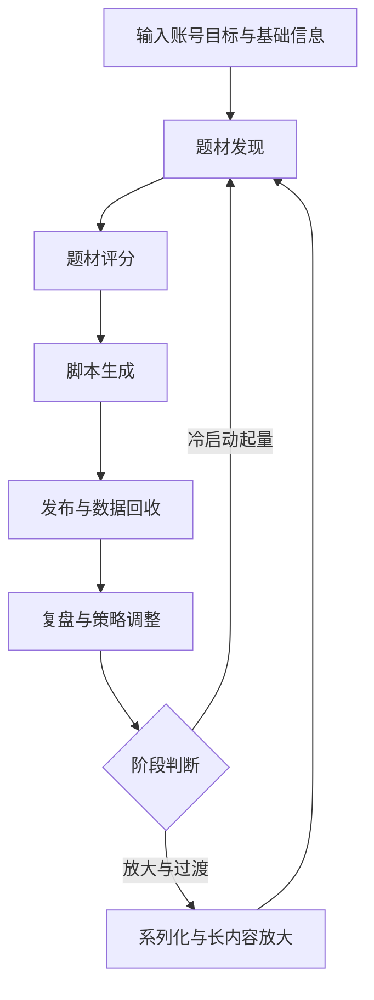

# TikTok 热门题材与脚本策略 Agent PRD V1.0

## 1. 文档信息

- **产品名称**：TikTok 热门题材与脚本策略 Agent
- **版本**：V1.0
- **文档类型**：PRD
- **产品阶段**：MVP 方案
- **适用对象**：产品、算法、工程、运营、内容策略团队

---

## 2. 项目背景

TikTok 新账号在冷启动阶段普遍面临以下问题：

1. 不知道当天应该做什么题材
2. 不知道同一个题材该如何包装才能更容易起量
3. 不知道哪些内容值得继续放大，哪些内容应快速停止
4. 不知道如何从“冲播放”过渡到“可持续原创内容体系”
5. 不知道如何兼顾推荐流、搜索流和后续 Creator Rewards 的内容要求

现有市场上的内容工具多聚焦于：

- 单次脚本生成
- 单次文案改写
- 素材生成
- 视频生成

但缺少一个围绕 **“题材选择—脚本生成—发布复盘—策略重分配”** 的闭环策略产品。

因此，需要设计一款面向 TikTok 创作者/内容团队的新产品，帮助用户在冷启动阶段更高效地找到更容易起量的内容组合，并在后续逐步过渡到更稳定、可持续的原创内容生产模式。

---

## 3. 产品定位

### 3.1 一句话定位

帮助 TikTok 新账号在冷启动阶段持续找到更容易起量的内容组合，并在后续逐步过渡到可持续的原创中视频内容。

### 3.2 产品本质

这不是一个“脚本生成器”，而是一个 **动态内容策略引擎**。

它的核心能力不是单次输出一条视频脚本，而是持续回答以下问题：

- 今天该做什么题材
- 同一题材该如何包装
- 哪种内容组合更适合当前账号
- 什么时候该继续放大，什么时候该停止
- 什么时候该从“冲播放”切换到“沉淀主题/系列内容”

### 3.3 目标用户

- TikTok 新账号创作者
- 内容工作室 / MCN
- 电商短视频团队
- 希望通过 AI 辅助进行选题和脚本策略决策的内容团队
- 未来可扩展至 MintReel 自有创作工作流用户

---

## 4. 产品目标

## 4.1 第一目标：冷启动起量

帮助新账号在前 30 天尽快提升播放表现，核心目标包括：

- 尽快接近近 30 天 100,000 播放
- 提升内容与受众的匹配效率
- 尽快找到“准赢家题材”
- 建立可持续迭代的内容实验盘

## 4.2 第二目标：放大与过渡

当账号跑出初步有效内容后，逐步把账号从“纯冲播放”切换到：

- 更稳定的主题表达
- 更高原创度内容
- 可扩展为 1 分钟以上的视频内容
- 可系列化、可沉淀的内容资产

## 4.3 非目标

本阶段不重点解决：

- 自动代运营全流程
- 自动发帖
- 粉丝运营与私域转化
- 全平台分发
- 广告投放优化
- 复杂视频编辑工作流

---

## 5. 核心设计原则

1. **先做策略，再做生成**
2. **按内容桶优化，不按单条视频优化**
3. **先改包装，再改题材**
4. **先找准赢家，再放大赢家**
5. **推荐流和搜索流分开管理**
6. **冷启动目标与后续变现目标分阶段设计**
7. **数据依赖兼容 TikTok 原生可得指标，不依赖某个不确定字段**

---

## 6. 产品整体方案

产品采用 **双模式 + 动态策略引擎** 方案。

## 6.1 模式 A：冷启动起量模式

### 目标

在账号前 30 天内，帮助用户尽快找到当前账号更容易起量的内容组合。

### 模式 A 的产品任务

- 发现当天值得做的题材
- 给出题材优先级
- 生成多版本脚本
- 跑内容实验
- 快速识别准赢家题材
- 输出下周策略重分配建议

### 模式 A 的核心特征

- 支持多个内容桶并行测试
- 允许多个长度、题材、表达形式同时探索
- 不追求统一风格，优先找内容与受众的匹配点
- 重点优化播放、留存、收藏、分享和关注转化

---

## 6.2 模式 B：放大与过渡模式

### 目标

在已经跑出有效内容后，帮助用户把短期有效内容转成更稳定的主题/系列内容，并为后续更长视频和持续变现做准备。

### 模式 B 的产品任务

- 放大表现持续领先的内容桶
- 构建系列内容
- 尝试更长内容版本
- 强化账号主题感
- 沉淀可复用内容资产

### 模式 B 的核心特征

- 减少平均试验，增加放大
- 以系列化和主题化为核心
- 支持从短视频扩写到更长结构
- 增加账号长期价值，而不只关注单条流量

---

## 7. 动态内容策略引擎

## 7.1 核心概念：内容组合

系统优化的对象不是单条视频，而是一个内容组合：

**内容组合 = 题材 × Hook × 表达形式 × 时长 × 是否系列化 × 是否偏搜索承接**

示例：

- 题材：爆款广告拆解
- Hook：反常识开头
- 形式：口播 + 屏录
- 时长：18 秒
- 系列化：否
- 搜索承接：中

---

## 7.2 核心概念：内容桶

为了避免被单条视频的波动误导，系统需要将内容归类为“内容桶”。

示例内容桶：

- 桶 A：8–15 秒 + 强反转
- 桶 B：15–35 秒 + 教程结构
- 桶 C：15–35 秒 + BTS 过程
- 桶 D：35–60 秒 + 案例拆解

产品对桶做决策，而不是对单条视频做决策。

---

## 7.3 调整节奏

### 日级调整

用于轻量优化，重点调整：

- Hook
- 首屏画面
- 标题 / 字幕关键词
- CTA
- 节奏细节

### 周级调整

用于结构性重分配，重点调整：

- 题材优先级
- 内容桶配比
- 是否继续某个内容方向
- 是否开始系列化
- 是否从模式 A 切换到模式 B

建议频率：

- 每 7 天一次
- 或每累计发布 10–20 条内容后一次

---

## 7.4 动态调整的归因逻辑

### 情况 1：播放低，前期留存也低

可能问题：

- Hook 不够强
- 首屏画面没有吸引力
- 题材表达不清晰

调整策略：

- 先改 Hook
- 先改首屏
- 不立即砍题材

### 情况 2：前期留存尚可，但完播偏低

可能问题：

- 中段节奏松散
- 结果出现太晚
- 脚本结构不够紧

调整策略：

- 缩短时长
- 提前给结果
- 重写中段结构

### 情况 3：播放可以，但关注转化低

可能问题：

- 内容有消费价值，但账号价值感不强
- 内容不具备系列性
- 用户不知道为什么要继续关注

调整策略：

- 增加系列感
- 固定栏目表达
- 强化账号主题承诺

### 情况 4：推荐流一般，但搜索承接较好

可能问题：

- 内容不适合爆发式推荐，但适合搜索和常青流量

调整策略：

- 保留为搜索型/常青型内容
- 不简单停掉
- 作为内容资产沉淀

### 情况 5：某个内容桶连续领先

调整策略：

- 提高其下周配比
- 生成更多相似结构的内容
- 尝试扩写为更长或系列内容

---

## 8. 核心功能模块

## 8.1 模块一：趋势与搜索发现

### 目标

帮助用户发现当天值得做的题材。

### 输入

- TikTok Creator Search Insights 热门搜索
- TikTok Creator Search Insights content gap
- 平台热门视频样本
- 评论区高频问题
- 用户历史发布数据
- 用户行业/产品信息

### 输出

- 今日候选题材池
- 搜索型题材
- 趋势型题材
- 常青型题材

---

## 8.2 模块二：题材评分器

### 目标

对候选题材进行结构化评分，选出最值得做的题材。

### 评分维度

- 需求强度
- 竞争强度
- 账号适配度
- 原创改写空间
- 可系列化程度
- 搜索承接能力
- 可扩成长内容潜力
- 素材执行可行性

### 输出

- 题材总分
- 推荐优先级
- 推荐模式（起量 / 搜索 / 系列 / 放大）

---

## 8.3 模块三：脚本生成器

### 目标

为题材生成结构化脚本版本，而不是输出单段长文案。

### 输出结构

- 标题候选
- Hook A / B
- 分镜节奏
- 口播稿
- 屏幕字幕
- CTA
- 推荐内容形式
- 推荐时长范围

### 设计原则

- 支持同一题材多版本生成
- 支持不同表达形式切换
- 支持从短版扩写成长版

---

## 8.4 模块四：内容桶管理器

### 目标

将视频按策略维度进行归类，并持续跟踪每一类内容的表现。

### 功能

- 定义内容桶
- 记录桶内视频
- 统计桶级指标
- 比较桶之间表现
- 标记准赢家桶 / 失败桶

### 输出

- 当前活跃内容桶
- 推荐保留桶
- 推荐停止桶
- 推荐加码桶

---

## 8.5 模块五：复盘与重分配

### 目标

基于最近一周表现，对下周内容策略进行自动调整。

### 输出

- 下周建议配比
- 应放大的题材
- 应停止的题材
- 应改写的包装方式
- 应尝试的时长变化
- 是否进入系列化
- 是否切换模式

---

## 9. 用户流程

## 9.1 冷启动期流程

1. 用户输入账号基础信息
2. 系统抓取趋势、搜索和外部热门样本
3. 系统生成候选题材池
4. 题材评分器输出 Top 题材
5. 脚本生成器输出多版本脚本
6. 用户发布内容
7. 系统回收内容表现数据
8. 内容桶管理器归类和比较
9. 复盘模块生成调整建议
10. 下一轮继续执行

## 9.2 放大期流程

1. 系统识别准赢家题材
2. 系统生成系列化建议
3. 系统生成更长内容版本
4. 用户继续发布
5. 系统观察系列续作表现
6. 逐步构建稳定内容体系

---

## 10. 数据输入与输出

## 10.1 用户输入

- 账号地区
- 语言
- 行业/产品类别
- 每日发片频率
- 可用素材类型
- 当前目标（冲播放 / 沉淀主题）
- 可接受的内容形式

## 10.2 系统自动输入

- TikTok 搜索趋势
- 热门视频样本
- 历史视频表现数据
- 评论与互动数据
- 发布频率和发布结果

## 10.3 每日输出

- 今日推荐 2 条内容计划
- 每条的题材解释
- 脚本版本 2 个
- Hook 2 个
- 推荐时长
- 推荐形式
- 是否适合续作

## 10.4 每周输出

- 本周内容桶表现报告
- 下周策略配比建议
- 准赢家题材清单
- 应停内容方向
- 是否切换模式建议

---

## 11. 数据可得性说明

本产品设计基于 TikTok 原生可获取数据进行兼容设计，不把不确定字段作为硬依赖。

### 11.1 硬依赖数据

- 视频播放量
- 平均观看时长（如可获取）
- 完播 / finish rate（如可获取）
- 点赞、评论、分享、收藏
- 关注转化（如可获取）
- 搜索趋势 / content gap（通过 Creator Search Insights）

### 11.2 可选数据

- 逐秒留存图
- 3 秒掉点
- 更细粒度受众行为曲线

### 11.3 设计原则

如果账号后台可提供 retention graph，则系统可进一步读取前几秒掉点；
若账号后台没有提供，则系统仅使用原生可得指标近似判断前期吸引力。

---

## 12. 核心指标体系

## 12.1 单条指标

- 播放量
- 平均观看时长
- 完播率
- 点赞率
- 评论率
- 分享率
- 收藏率
- 关注转化

## 12.2 内容桶指标

- 桶平均播放
- 桶平均观看时长
- 桶平均完播
- 桶收藏率
- 桶分享率
- 桶关注转化
- 桶系列续作表现

## 12.3 账号阶段指标

- 近 7 天总播放
- 近 30 天总播放
- 准赢家题材数量
- 可系列化题材数量
- 可扩成长版内容数量
- 模式切换准备度

---

## 13. MVP 范围

## 13.1 MVP 包含

1. 题材发现
2. 题材评分
3. 结构化脚本生成
4. 内容桶管理
5. 周级复盘与重分配

## 13.2 MVP 不包含

- 自动发帖
- 多平台联动
- 复杂视频编辑
- 多 Agent 协作系统
- 复杂素材库管理
- 商业化投放优化
- 深度用户画像系统

## 13.3 MVP 成功标准

- 能持续为用户输出每天 2 条内容计划
- 前 10–20 条内容后识别出 1–2 个准赢家题材
- 能解释为什么建议继续/停止某类内容
- 用户愿意按建议继续发布下一轮内容

---

## 14. 风险与限制

## 14.1 平台数据限制

TikTok 不同账号、地区、版本可能可见的数据字段不同，需做兼容设计。

## 14.2 题材同质化风险

若系统过度依赖外部热门样本，可能导致内容高度趋同，需强调原创改写和结构迁移。

## 14.3 账号标签混乱风险

冷启动阶段若同时测试过多方向，可能导致账号定位不清晰，需要控制实验范围。

## 14.4 合规风险

AI 生成内容涉及平台披露、原创性和版权风险，后续需考虑增加合规提示模块。

## 14.5 误判风险

短期数据波动大，不能依赖单条视频做重大策略调整，必须坚持内容桶级决策。

---

## 15. 开放问题

1. Creator Search Insights 的数据接入方式是否可自动化，还是需人工半自动输入
2. 内容桶的默认分类模板是否需要按行业配置
3. 周级重分配是否需要支持人工覆盖
4. 是否需要在模式 B 中引入“系列策划器”
5. 是否需要后续增加“热门视频抽象与原创改写引擎”
6. 后续是否将本产品与 MintReel 视频生成链路直接打通

---

## 16. 一句话总结

**TikTok 热门题材与脚本策略 Agent 不是帮用户写一条视频，而是帮助用户在冷启动阶段持续找到更容易起量的内容组合，并在起量后逐步过渡到可持续的原创内容体系。**
