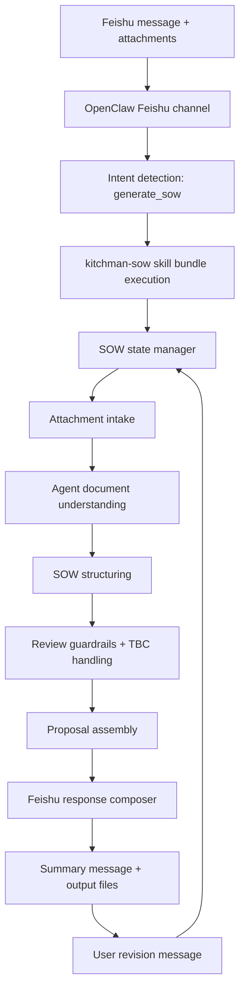
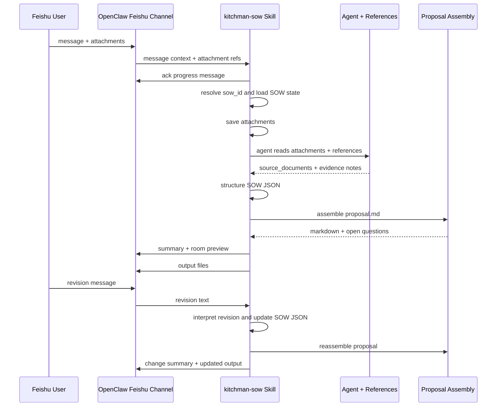

# Kitchman SOW Skill 技术方案

## 1. 目标

本文基于 `PRD.md`，定义 `kitchman-sow` skill 的整体技术框架和第一个飞书 demo 版本的技术方案。

第一版目标不是做完整报价系统，而是打通可演示闭环：

1. 用户在飞书中发送 SOW 请求并上传附件。
2. OpenClaw 识别意图并触发 `kitchman-sow` skill。
3. Skill 基于本次消息和附件生成结构化 SOW JSON。
4. Skill 返回飞书摘要、待确认项和 Markdown proposal。
5. 用户继续在飞书里发修改指令，系统更新 SOW JSON 和 proposal。

## 1.1 OpenClaw Skill 机制评审结论

对 openclaw 目录下已有 skill 和官方系统 skill 的实现方式做过对比后，`kitchman-sow` 不应设计成一个独立应用服务或 TypeScript runtime。更合适的实现形态是标准 skill bundle：

- `SKILL.md`：只放触发条件、核心工作流、必须遵守的边界和 reference 导航。
- `references/`：放 SOW schema、proposal 模板约束、709 案例笔记、飞书交互规范等长文档。
- `scripts/`：v0.1 只放轻量、确定性的 Python 工具，例如 SOW 状态读写和输出校验；不把图纸理解、docx/PDF 解析、scope 抽取做成重脚本。
- `assets/`：放真正被复制或渲染使用的模板文件；如果模板本身需要被模型阅读，优先放 `references/`。

因此第一版技术方案需要按“agent 阅读 `SKILL.md` 后，按需读取 references，并生成可审核 artifacts”的方式设计，而不是把 skill 设计成常驻后端服务。Python scripts 是可选增强，只承担状态和校验这类确定性工作。

## 2. 设计原则

- 飞书优先：客户演示入口是飞书消息，不设计独立 Web 工作台。
- 附件优先：demo v0.1 只基于当前会话和上传附件，不接企业知识库。
- 可追溯：所有 room scope、finish、exclusion、special note 都要带 `source_type`、`confidence` 和 evidence。
- 不生成价格：价格字段保留为空或占位。
- 不改私有边界：skill 不直接 deep import `extensions/feishu/src/**`。需要飞书能力时优先使用 OpenClaw 已暴露的 channel / message / media 能力。
- 先 Markdown 后 DOCX：Markdown 是结构化渲染源，v0.3 增加简版 `proposal.docx` 作为交付格式。
- 不做规则匹配式文档处理：v0.1 不用脚本硬编码图纸解析、room 识别或 scope 匹配，文档理解由 agent 结合附件和 references 完成。
- 可降级：图纸无法可靠解析时，输出待确认项，而不是编造内容。

## 3. 整体技术框架



## 4. 组件划分

### 4.1 Feishu Channel Layer

职责：

- 接收飞书消息、附件和会话 metadata。
- 将消息转交给 OpenClaw agent runtime。
- 提供回复消息和文件上传能力。

技术约束：

- demo 技术方案不要求直接改 `extensions/feishu` 的私有实现。
- 如果现有 OpenClaw message tool 已能读取附件和发送文件，则 skill 直接使用该能力。
- 如果附件二进制无法到达 skill，才增加一个最小公开能力：将当前消息附件保存为本地文件，并把路径传给 agent。

相关现有能力：

- Feishu extension 已有 message reply/send 能力。
- Feishu extension 已有 message resource download / file upload 相关实现。
- 方案上应依赖公开 plugin/channel contract，不从 skill 内部直接 import extension private files。

### 4.2 Skill Bundle Execution Layer

职责：

- 判断当前任务是否属于 Kitchman SOW 生成。
- 管理当前 `sow_id` 对应的 SOW 业务状态。
- 指导 agent 读取必要 reference，理解附件内容，生成 SOW JSON、proposal 和待确认项。
- 必要时调用轻量 Python 脚本保存 SOW 状态或校验输出，不调用重脚本处理文档内容。

建议目录：

```text
skills/kitchman-sow/
  SKILL.md
  references/
    prd.md
    technical-design.md
    feishu-integration.md
    workflow.md
    sow-schema.md
    proposal-template.md
    review-guardrails.md
    709-case-notes.md
  scripts/                 # lightweight deterministic helpers
    render_pdf_pages.py
    build_drawing_index.py
    render_sow_outputs.py
    sow_state.py
    validate_sow_outputs.py
```

说明：

- `SKILL.md` 只保留核心工作流、何时读取 reference、何时运行脚本。
- 详细 schema、输出约束、模板、案例笔记放到 `references/`，避免主 skill 过长。
- 飞书触发、附件 intake、分层回复和 smoke test 细节放到 `references/feishu-integration.md`。
- v0.2 收尾允许轻量确定性脚本：PDF 转 PNG、页标题索引、JSON 渲染 Markdown、状态检查和输出校验。脚本不负责理解图纸 scope。
- `PRD.md` 和 `TECHNICAL_DESIGN.md` 当前可作为设计阶段文档保留；进入可用 skill bundle 时建议迁移或复制到 `references/prd.md` 和 `references/technical-design.md`。

### 4.3 SOW State Manager

职责：

- 管理 `sow_id` 下的 SOW 业务状态。
- 读取 OpenClaw 提供的飞书会话、消息、附件 metadata，但不创建或维护 OpenClaw conversation / session。
- 保存输入消息引用、附件引用、解析结果、SOW JSON、proposal Markdown、open questions。
- 支持同一飞书会话内的多轮修改。

非职责：

- 不负责创建飞书 `conversation_id`。
- 不负责管理 OpenClaw agent session。
- 不负责飞书消息路由、回复目标、账号选择或附件下载权限。

demo v0.1 存储：

- 使用本地临时目录或 OpenClaw 可写 workspace。
- 路径示例：`.openclaw-runtime/kitchman-sow/sows/<sow_id>/`。
- 如果不想写入 repo，可使用系统临时目录，最终只把输出发回飞书。

`sow_id` 生成策略：

- 如果用户明确给出项目名或地址，使用规范化项目名加日期，例如 `sow-709-riversdale-road-20260425`。
- 如果项目名缺失，使用 OpenClaw 提供的消息 id 或 run id 派生短 id，例如 `sow-msg-abc123`。
- 后续飞书修正消息优先复用当前会话最近一次 active `sow_id`。

建议状态文件：

```json
{
  "sow_id": "sow-709-riversdale-road-20260425",
  "sow_status": "awaiting_review",
  "runtime_ref": {
    "channel": "feishu",
    "conversation_id": "from-openclaw",
    "requested_by": "from-openclaw"
  },
  "source_messages": [],
  "source_documents": [],
  "sow_extraction_path": "sow-extraction.json",
  "proposal_markdown_path": "proposal.md",
  "proposal_docx_path": "proposal.docx",
  "open_questions_path": "open-questions.md",
  "revision_history": []
}
```

实现方式：

- 在 skill 里它不是一个常驻服务，而是一组脚本和文件约定。
- `scripts/sow_state.py` 提供 `resolve_sow_id`、`load_sow_state`、`save_sow_state`、`append_revision`。
- 每次触发时先从 OpenClaw runtime metadata 和当前消息推导 `sow_id`。
- 如果该 `sow_id` 已存在，加载已有 `sow-state.json` 并应用新消息或修正。
- 如果不存在，初始化 `sow-state.json`、`input/`、`output/` 三类目录。
- 所有解析器和渲染器只读写该 `sow_id` 目录下的文件。
- 输出到飞书后，把生成文件路径、message id、revision 摘要写回 `sow-state.json`。

推荐目录：

```text
<sow_workspace>/<sow_id>/
  sow-state.json
  input/
    original files...
  intermediate/
    source-documents.json
    extracted-pages.json
  output/
    sow-extraction.json
    proposal.md
    proposal.docx
    open-questions.md
```

### 4.4 Attachment Intake

职责：

- 接收 OpenClaw 传入的附件信息。
- 下载或定位本地文件。
- 标准化文件 metadata。
- 将文件保存到 `sow_id` workspace。

输出：

```json
{
  "id": "doc-001",
  "source_message_id": "msg-001",
  "file_name": "709 Riversdale Road, Camberwell_JD.pdf",
  "local_path": ".../input/709-riversdale-road-camberwell-jd.pdf",
  "mime_type": "application/pdf",
  "size_bytes": 12345678,
  "type": "joinery_drawing",
  "text_extractable": false,
  "requires_visual_reading": true
}
```

### 4.5 Agent Document Understanding Layer

v0.1 不建设脚本化文档解析器。Agent 直接基于 OpenClaw 提供的附件内容、文档文本、页面可见信息和 references 完成理解，并在不确定时输出待确认项。

按文件类型的处理边界：

| 文件类型      | demo v0.1 行为                                                             | v0.2+ 行为                        |
| ------------- | -------------------------------------------------------------------------- | --------------------------------- |
| docx proposal | Agent 参考其章节结构和措辞，不写 docx 解析脚本                             | 后续可做模板字段抽取              |
| PDF 图纸      | Agent 结合附件可读内容和 709 reference 生成可审核 SOW，不写 PDF 解析重脚本 | 后续可加页截图、OCR、视觉模型辅助 |
| 图片 / 手写   | 只在信息清晰时采纳，其他进入待确认项                                       | OCR + 视觉理解                    |
| Excel / CSV   | v0.1 仅作为材料 / 五金信息来源提示                                         | 后续解析材料 / 五金表             |

demo v0.1 对 709 golden sample 的处理原则：

- 使用 `references/709-case-notes.md` 帮助 agent 理解案例结构，但不能把它描述成脚本自动识别结果。
- Agent 需要保留 evidence、source_type 和 confidence，说明哪些来自附件、哪些来自案例笔记、哪些是推断。
- 对未知项目，输出较保守的 `source_documents`、可确认 scope 和 open questions。

### 4.6 SOW Structuring Pipeline

处理阶段是 agent 工作流，不是脚本规则链：

1. 建立或读取 `sow_id` 对应的 SOW state。
2. 整理附件清单和 source document metadata。
3. 读取 `sow-schema.md`、`proposal-template.md`、`review-guardrails.md`。
4. 对 709 demo 读取 `709-case-notes.md`。
5. 提取项目 metadata。
6. 按 room / area 组织 scope。
7. 标注 included / excluded / TBC。
8. 生成 finish schedule、exclusions 和 special notes。
9. 生成 open questions。
10. 输出 `sow-extraction.json`、`proposal.md`、`proposal.docx`、`open-questions.md`。

每个阶段都应保留可追溯信息。信息不足时不终止整个任务，而是降级到待确认项。

### 4.7 Proposal Assembly

输入：

- `sow-extraction.json`
- Markdown proposal template

输出：

- `proposal.md`
- `proposal.docx`

生成约束：

- 不写最终价格。
- `unknown`、`inferred`、`low confidence` 内容不写成确定承诺。
- proposal 正文只放可审核内容。
- open questions 单独输出，不混在客户可见正文里。

### 4.8 Revision Handler

职责：

- 解析用户在飞书中的修改指令。
- 定位要修改的 room、scope item、finish、exclusion 或 open question。
- 更新 SOW JSON。
- 重新生成 proposal。
- 回复变更摘要。

demo v0.1 不使用规则匹配脚本处理修正。Agent 结合当前 SOW JSON、SOW state 和用户修正消息判断修改意图；如果修改对象不明确，应在飞书追问，而不是硬套规则。

支持示例：

| 用户指令                     | 更新行为                                                       |
| ---------------------------- | -------------------------------------------------------------- |
| `Kitchen stone 全部排除`     | Agent 更新 GF Kitchen 的 stone exclusion，并记录 revision      |
| `LED 也排除`                 | Agent 更新 lighting fixture exclusion，并记录 revision         |
| `Pantry 门只写 cladding`     | Agent 将 Pantry door scope 改为 cladding only，并记录 revision |
| `Master WIR mirror 改成 TBC` | Agent 将对应 finish / item 标记 TBC，并记录 revision           |
| `生成客户版 proposal`        | 重新渲染 Markdown proposal                                     |

### 4.9 Feishu Response Composer

飞书消息分层输出：

1. 任务确认消息。
2. 附件识别摘要。
3. 分析进度消息。
4. SOW 完成摘要。
5. 关键 room preview。
6. 待确认项摘要。
7. 输出文件。

避免在飞书中直接贴完整 proposal。完整内容以附件或文件链接交付。

## 5. 核心数据模型

核心数据模型以 JSON artifact 为准，由 skill 生成，必要时用轻量 Python 脚本保存状态或校验输出。文档中使用 JSON 示例说明字段契约，不绑定 TypeScript runtime。

### 5.1 Source Document

```json
{
  "id": "doc-001",
  "source_message_id": "msg-001",
  "file_name": "709 Riversdale Road, Camberwell_JD.pdf",
  "local_path": "input/709-riversdale-road-camberwell-jd.pdf",
  "mime_type": "application/pdf",
  "size_bytes": 12345678,
  "type": "joinery_drawing",
  "text_extractable": false,
  "requires_visual_reading": true,
  "confidence": "high",
  "notes": []
}
```

### 5.2 Evidence

```json
{
  "file_name": "709 Riversdale Road, Camberwell_JD.pdf",
  "page_number": 4,
  "drawing_ref": "GF Kitchen",
  "view_ref": "Elevation",
  "message_ref": "msg-001",
  "evidence_type": "demo_rule",
  "confidence": "medium"
}
```

### 5.3 Scope Item

```json
{
  "id": "scope-gf-kitchen-overheads",
  "item": "Overhead cabinets",
  "category": "cabinet",
  "included": true,
  "source_type": "observed_from_drawing",
  "confidence": "medium",
  "evidence": [],
  "review_status": "unreviewed"
}
```

## 6. Demo v0.1 技术方案

### 6.1 Demo v0.1 目标

以 709 案例打通完整飞书链路：

1. 飞书触发。
2. 附件 intake。
3. 文件分类。
4. Agent 结合 709 reference 生成 SOW。
5. Markdown proposal 生成。
6. open questions 生成。
7. 飞书分层回复。
8. 支持 3 类简单修改并重新生成输出文件。

### 6.2 v0.1 实现策略

使用“附件上下文 + 709 reference + SOW schema + agent 组织”的方式。

不要求 v0.1 完全从图纸视觉中自动提取所有 scope。v0.1 重点是演示业务闭环和输出质量：

- 不写 PDF/docx/OCR 重脚本。
- 不用规则匹配硬编码文档理解。
- 709 的房间和重点 scope 使用 reference 样例辅助 agent 组织。
- Caveat、exclusions 和 open questions 由 agent 按 references 约束生成，并保留 TBC / confidence。
- Proposal 由模板渲染生成。

这样能避免第一版被复杂图纸视觉理解拖住。

### 6.3 v0.1 输入

飞书输入：

```text
我现在要出一下 709 Riversdale Road 项目的 SOW，上传的文件是项目图纸和客户定制需求。
```

附件：

- 709 joinery drawing PDF。
- Kitchman proposal docx 样本。
- 可选客户需求文本或图片。

本地开发输入可直接通过 Codex / OpenClaw 对话模拟，不要求先实现离线 runner。若后续需要可重复离线演示，再补轻量 wrapper，但 wrapper 不负责文档理解，只负责组织输入、调用状态工具和收集输出。

### 6.4 v0.1 处理流程



### 6.5 v0.1 模块任务

| 模块                         | 输入                                     | 输出                           | 说明                                                  |
| ---------------------------- | ---------------------------------------- | ------------------------------ | ----------------------------------------------------- |
| Intent detector              | message text                             | `generate_sow` / no-op         | 关键词 + LLM 判断                                     |
| SOW state manager            | OpenClaw runtime metadata + message text | `sow_id`, workspace            | 轻量状态管理，可由 `sow_state.py` 辅助                |
| Attachment intake            | attachment refs                          | local files                    | 下载 / mock 复制                                      |
| Source document inventory    | attachments + visible metadata           | `source_documents`             | Agent 整理附件清单，不写分类重脚本                    |
| PDF page renderer            | PDF drawing                              | PNG pages + render manifest    | 机械转换并记录总页数 / 截断状态                       |
| Drawing index builder        | PDF text layer + render manifest         | `drawing-index.json`           | 页标题、drawing number、area candidates，不抽取 scope |
| Agent document understanding | attachments + references                 | evidence notes                 | Agent 理解文档内容，不做规则匹配脚本                  |
| SOW structuring              | evidence notes + 709 reference           | `sow-extraction.json`          | v0.1 核心，由 agent 组织                              |
| Proposal assembly            | SOW JSON                                 | `proposal.md`, `proposal.docx` | `render_sow_outputs.py --docx` 按结构化 JSON 渲染     |
| Questions builder            | SOW JSON                                 | `open-questions.md`            | `render_sow_outputs.py` 汇总待确认项                  |
| Revision handler             | revision text + SOW JSON                 | updated SOW JSON               | Agent 理解修正，必要时追问                            |
| Feishu composer              | outputs                                  | messages + files               | 分层回复                                              |
| Output validator             | output files                             | validation report              | 可选轻脚本，检查文件和关键约束                        |

### 6.6 v0.1 输出

飞书摘要：

```text
SOW 已生成。

识别到 2 份资料、9 个区域、约 38 个 scope items、8 个待确认问题。
价格字段已留空，没有生成最终报价金额。
```

关键预览：

```text
GF Kitchen
- Overheads / Base / Drawers / Fridge CUPD / Oven Tower / Wall Panel
- 2 curved structures at back of island
- Pantry door: cladding only, door structure and hardware TBC
- Finish: Door/Panel TBC, Carcass White Melamine
```

文件：

- `sow-extraction.json`
- `proposal.md`
- `proposal.docx`
- `open-questions.md`

### 6.7 v0.1 验收标准

- 飞书触发语识别成功。
- 能保存并列出全部附件。
- 能识别 709 proposal 样本和 joinery drawing。
- 能生成 9 个 709 room / area。
- 能生成 Kitchen、Pantry、Living、Laundry、WIR、Robe 的核心 scope。
- 能生成至少 5 个 open questions。
- 不生成最终价格。
- 能处理至少 3 类飞书修正指令。
- 修正后 SOW JSON 和 proposal Markdown 内容更新。
- 完整结果以文件形式返回，不刷屏。

## 7. 开发步骤

### Step 1: Skill 骨架

产物：

- `skills/kitchman-sow/SKILL.md`
- `skills/kitchman-sow/references/workflow.md`
- `skills/kitchman-sow/references/sow-schema.md`
- `skills/kitchman-sow/references/review-guardrails.md`
- `skills/kitchman-sow/references/709-case-notes.md`
- `skills/kitchman-sow/references/proposal-template.md`

目标：

- 让 agent 在飞书 SOW 请求中能稳定触发该 skill。
- 固化工作流和输出约束。
- 保持 `SKILL.md` 精简，详细 schema、模板和审核约束通过 reference 按需加载。

### Step 2: 轻量状态和校验脚本

产物：

- `skills/kitchman-sow/scripts/sow_state.py`
- `skills/kitchman-sow/scripts/render_pdf_pages.py`
- `skills/kitchman-sow/scripts/build_drawing_index.py`
- `skills/kitchman-sow/scripts/render_sow_outputs.py`
- `skills/kitchman-sow/scripts/validate_sow_outputs.py`

目标：

- 管理 `sow_id`、`sow-state.json`、workspace 路径和 revision history。
- 记录已有输出状态，支持超时后直接返回已生成文件。
- 渲染 PDF 页面并检查是否漏页。
- 生成图纸页索引，辅助 agent 在视觉审查前确认页覆盖。
- 从 `sow-extraction.json` 稳定渲染 Markdown 输出。
- 用校验脚本验证输出 artifact 的基本契约。
- 不在脚本里解析 PDF/docx、识别 room、抽取 scope 或处理自然语言修正。

### Step 3: Feishu 入口适配

产物：

- 飞书消息上下文到 skill 工作流输入的映射。
- 附件保存到 `sow_id` workspace。
- 分层回复模板。
- `references/feishu-integration.md`。
- `fixtures/709-demo/feishu-smoke-script.md`。
- `fixtures/709-demo/demo-runbook.md`。

目标：

- 飞书消息能触发 skill。
- 用户能看到进度消息和输出文件。

### Step 4: Revision 处理

产物：

- revision 工作流写入 `SKILL.md` 和 `references/workflow.md`。
- 修正记录写入 `sow-state.json` 的 `revision_history`。

目标：

- 支持 Kitchen stone exclusion、LED exclusion、Pantry cladding only、Mirror TBC 等演示修改。
- 不用规则匹配脚本硬编码这些修改；由 agent 基于当前 SOW JSON 和用户消息完成。

### Step 5: Demo 验收

产物：

- 709 演示用例。
- 3 条飞书触发语。
- 3 条飞书修正语。
- 输出样例。
- Demo runbook 和质量评审清单。

目标：

- 可以稳定进行客户演示。

## 8. 测试策略

### 8.1 轻量脚本测试

覆盖：

- `sow_state.py` 的 `sow_id` 生成、state 初始化、state 读取保存、revision history 追加。
- `validate_sow_outputs.py` 的输出文件存在性、JSON 基本字段、禁止价格字段、open questions 非空检查。

不覆盖：

- PDF/docx 内容解析。
- room / scope 自动抽取。
- 自然语言修正规则匹配。

### 8.2 本地集成测试

使用输出校验脚本：

```bash
python3 skills/kitchman-sow/scripts/validate_sow_outputs.py --root /tmp/kitchman-sow-demo
```

验证：

- 输出文件存在。
- JSON schema 基本合法。
- proposal 不包含最终报价金额。
- open questions 不为空。

### 8.3 飞书 smoke test

验证：

- 飞书消息触发。
- 附件 intake。
- 进度消息。
- 输出文件。
- 修正指令重新生成。

## 9. 风险和取舍

| 风险                                | 取舍                                                             |
| ----------------------------------- | ---------------------------------------------------------------- |
| v0.1 图纸理解不够自动               | 明确 v0.1 是 agent + reference 演示闭环，v0.2 再强化真实图纸解析 |
| 飞书附件能力在 skill 中不可直接访问 | 通过 OpenClaw channel/message 工具或最小公开适配层传入本地文件   |
| 完整 docx 排版耗时                  | v0.1 只输出 Markdown                                             |
| 企业知识库还没有                    | demo 使用 709 案例 reference，不做历史召回                       |
| 用户以为能自动报价                  | 所有回复明确价格留空                                             |
| 长任务阻塞对话体验                  | 分阶段回复进度                                                   |

## 10. 后续演进

### v0.2

- 引入 PDF 页截图和 OCR。
- 真实 room / area 抽取。
- 图纸页和 room 自动关联。
- Evidence 展示更完整。
- 多项目样本验证。

### v0.3

- 更强自然语言 revision。
- 简版 docx 输出。
- 当前会话内 revision history。

### v1.0

- 企业知识库。
- 历史 proposal 检索。
- 材料 / 五金库。
- 报价辅助。
- 更完整的客户交付文档导出。
